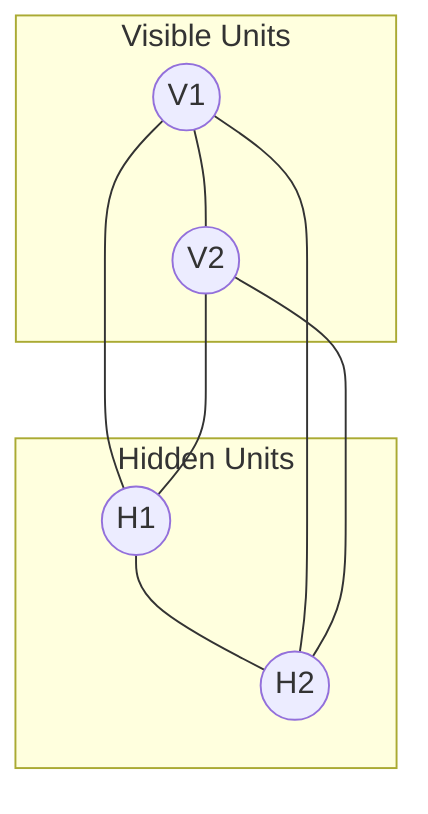

# Boltzmann Machines

Boltzmann Machines are stochastic recurrent neural networks that use a "Gibbs distribution" to model joint probability distributions. They are named after the Boltzmann distribution in statistical mechanics.

## Diagram

## Key Characteristics
- **Generative Model**: Can learn to represent and sample from complex data distributions.
- **Learning**: Typically uses Contrastive Divergence (CD) or simulated annealing.
- **Architecture**: Fully connected undirected graph with hidden and visible units.

[Back to README](../README.md)
