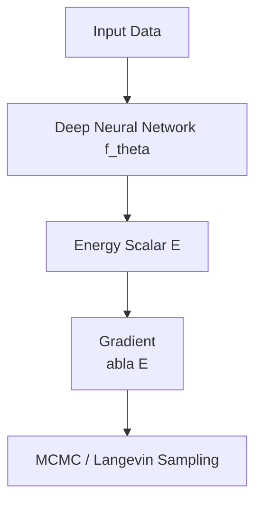

# Deep Energy-Based Models

Deep Energy-Based Models (DEBMs) use deep neural networks (like CNNs or MLPs) to parameterize the energy function. This allows them to capture extremely complex high-dimensional patterns in data such as images and text.

## Diagram

## Key Characteristics
- **Implicit Modeling**: No need for a normalized probability density during training.
- **Contrastive Divergence**: Pushing down energy of real samples and pushing up energy of "fakes".
- **Flexibility**: Can be integrated with any modern neural architecture.

[Back to README](../README.md)
