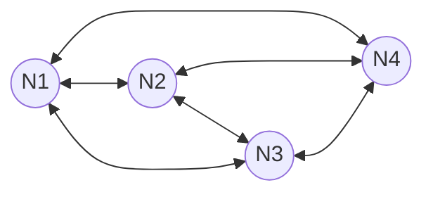

# Hopfield Networks

Hopfield Networks are a form of associative memory system introduced by John Hopfield in 1982. They are recurrent neural networks that store information in the weights of the connections between neurons, creating an energy landscape where memories correspond to local minima.

## Diagram

## Key Characteristics
- **Associative Memory**: Can retrieve a stored pattern from a noisy or partial version.
- **Energy Function**: $E = -1/2 \sum w_{ij} s_i s_j$.
- **Convergence**: Guaranteed to converge to a local minimum of the energy function.

[Back to README](../README.md)
