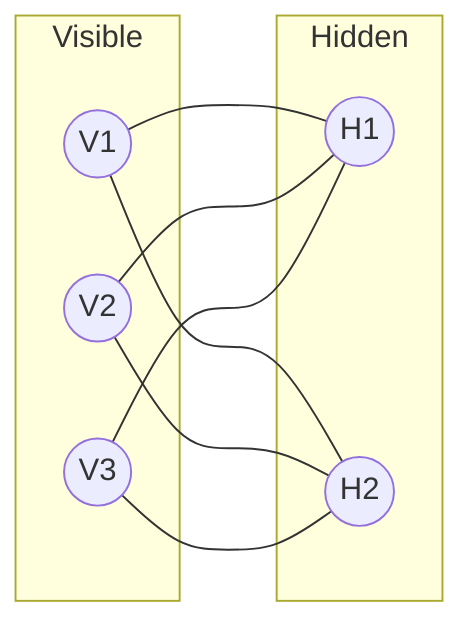

# Restricted Boltzmann Machines (RBMs)

Restricted Boltzmann Machines are a variant of Boltzmann Machines with the restriction that there are no connections between units in the same layer. This bipartite structure makes training significantly more efficient.

## Diagram

## Key Characteristics
- **Bipartite Graph**: No intra-layer connections.
- **Deep Belief Networks**: RBMs are the building blocks of DBNs.
- **Efficiency**: Can be trained using the Contrastive Divergence (CD) algorithm.

[Back to README](../README.md)
